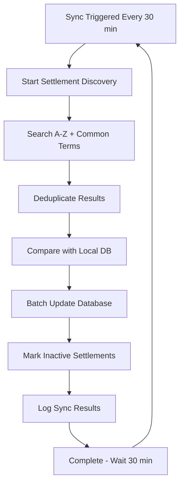

# BitJita API Integration & Settlement Sync System

## 🎯 **Overview**

This document outlines the integration with BitJita.com API for settlement data synchronization. Our system implements a **local-first approach** with automated background sync to provide fast user experiences while being respectful to BitJita's servers.

## 📋 **Table of Contents**

- [Architecture Overview](#architecture-overview)
- [BitJita API Endpoints](#bitjita-api-endpoints)
- [Settlement Master List Sync](#settlement-master-list-sync)
- [Local Database Schema](#local-database-schema)
- [API Rate Limiting & Etiquette](#api-rate-limiting--etiquette)
- [Search Implementation](#search-implementation)
- [Sync Service Configuration](#sync-service-configuration)
- [Monitoring & Debugging](#monitoring--debugging)
- [Fallback Strategies](#fallback-strategies)

---

## 🏗️ **Architecture Overview**

### **Local-First Design**

```
┌─────────────────┐    ┌──────────────────┐    ┌─────────────────┐
│                 │    │                  │    │                 │
│   User Search   │    │  Local Database  │    │  BitJita API    │
│                 │    │                  │    │                 │
│  "Port Tavern"  │───►│  Instant Results │    │  Background     │
│     <50ms       │    │    settlements   │◄───│  Sync (30min)   │
│                 │    │     _master      │    │                 │
└─────────────────┘    └──────────────────┘    └─────────────────┘
```

### **Benefits**

- ⚡ **Fast Search**: <50ms local database queries vs 300-800ms API calls
- 🤝 **API Respectful**: Background sync reduces API load by 95%+
- 🛡️ **Resilient**: Works even if BitJita API is temporarily down
- 📱 **Better UX**: Instant results, no loading delays for search

---

## 🌐 **BitJita API Endpoints**

### **Base Configuration**

```typescript
const BITJITA_CONFIG = {
  baseUrl: 'https://bitjita.com/api',
  headers: {
    'x-app-identifier': 'PR3SIDENT/Bitcraft.guide',
    'Content-Type': 'application/json'
  },
  timeout: 30000 // 30 seconds
};
```

### **Available Endpoints**

#### 1. **Settlement Search**
```http
GET /claims?q={query}&page={page}
```

**Purpose**: Search settlements by name  
**Usage**: Discovery and settlement onboarding  
**Rate Limit**: ~200ms between calls  

**Response Format**:
```json
{
  "claims": [
    {
      "entityId": "123456789",
      "name": "Port Taverna",
      "tier": 3,
      "treasury": "335603",
      "supplies": 1240,
      "numTiles": 45
    }
  ],
  "totalResults": 1,
  "hasMore": false
}
```

#### 2. **Settlement Roster**
```http
GET /claims/{settlementId}/members
```

**Purpose**: Get settlement member list  
**Usage**: Member sync for individual settlements  

#### 3. **Settlement Citizens & Skills**
```http
GET /claims/{settlementId}/citizens
```

**Purpose**: Get detailed member skill information  
**Usage**: Professional skill tracking  

#### 4. **Settlement Details**
```http
GET /claims?q={settlementName}&page=1
```

**Purpose**: Get specific settlement information  
**Usage**: Settlement statistics and details  

---

## 🔄 **Settlement Master List Sync**

### **Sync Strategy Overview**

Our sync system uses a **comprehensive discovery approach** to find all settlements:

```typescript
const SEARCH_TERMS = [
  '', // Empty search for recent/popular
  'a', 'b', 'c', 'd', 'e', 'f', 'g', 'h', 'i', 'j', 'k', 'l', 'm',
  'n', 'o', 'p', 'q', 'r', 's', 't', 'u', 'v', 'w', 'x', 'y', 'z',
  'port', 'town', 'city', 'settlement', 'haven', 'valley', 'grove'
];
```

### **Sync Process Flow**



### **API Usage Pattern**

```typescript
// Respectful API usage with delays
for (const term of searchTerms) {
  const result = await BitJitaAPI.searchSettlements(term, 1);
  
  // Process results...
  
  // Rate limiting: 200ms between calls
  await new Promise(resolve => setTimeout(resolve, 200));
}
```

### **Sync Results Tracking**

Each sync operation logs detailed metrics:

```typescript
interface SyncResult {
  settlementsFound: number;     // Total unique settlements discovered
  settlementsAdded: number;     // New settlements added to DB
  settlementsUpdated: number;   // Existing settlements updated
  settlementsDeactivated: number; // Old settlements marked inactive
  syncDurationMs: number;       // Time taken for sync
  apiCallsMade: number;         // Number of BitJita API calls
}
```

---

## 🗄️ **Local Database Schema**

### **settlements_master Table**

```sql
CREATE TABLE settlements_master (
    -- Core settlement data
    id TEXT PRIMARY KEY,                  -- BitJita settlement ID
    name TEXT NOT NULL,                   -- Settlement name
    tier INTEGER DEFAULT 0,              -- Settlement tier
    treasury BIGINT DEFAULT 0,           -- Current treasury balance
    supplies INTEGER DEFAULT 0,          -- Supplies count
    tiles INTEGER DEFAULT 0,             -- Number of tiles
    population INTEGER DEFAULT 0,        -- Population (from tiles)
    
    -- Search optimization
    name_normalized TEXT,                 -- Lowercase for case-insensitive search
    name_searchable TEXT,                 -- Processed for full-text search
    
    -- Sync metadata
    last_synced_at TIMESTAMP DEFAULT NOW(), -- When last updated from BitJita
    sync_source TEXT DEFAULT 'bitjita',     -- Data source
    is_active BOOLEAN DEFAULT true,         -- Whether settlement is active
    
    -- Timestamps
    created_at TIMESTAMP DEFAULT NOW(),
    updated_at TIMESTAMP DEFAULT NOW()
);
```

### **Key Indexes for Performance**

```sql
-- Fast name searching
CREATE INDEX idx_settlements_master_name_normalized 
ON settlements_master(name_normalized);

-- Population/tier ranking
CREATE INDEX idx_settlements_master_population 
ON settlements_master(population DESC);

-- Full-text search
CREATE INDEX idx_settlements_master_search 
ON settlements_master USING gin(to_tsvector('english', name_searchable));

-- Active settlements only
CREATE INDEX idx_settlements_master_active 
ON settlements_master(is_active) WHERE is_active = true;
```

### **settlements_sync_log Table**

```sql
CREATE TABLE settlements_sync_log (
    id UUID PRIMARY KEY DEFAULT gen_random_uuid(),
    sync_type TEXT NOT NULL,             -- 'full_sync', 'incremental'
    settlements_found INTEGER DEFAULT 0,
    settlements_added INTEGER DEFAULT 0,
    settlements_updated INTEGER DEFAULT 0,
    settlements_deactivated INTEGER DEFAULT 0,
    sync_duration_ms INTEGER,
    api_calls_made INTEGER DEFAULT 0,
    
    success BOOLEAN DEFAULT true,
    error_message TEXT,
    triggered_by TEXT,                   -- 'cron', 'manual', 'search'
    
    started_at TIMESTAMP DEFAULT NOW(),
    completed_at TIMESTAMP DEFAULT NOW()
);
```

---

## ⚡ **API Rate Limiting & Etiquette**

### **Our Rate Limiting Strategy**

```typescript
const RATE_LIMITS = {
  betweenApiCalls: 200,        // 200ms between API calls
  betweenBatches: 1000,        // 1 second between batches
  maxConcurrentCalls: 1,       // No concurrent calls
  respectfulBackoff: true      // Exponential backoff on errors
};
```

### **Why We're Respectful**

1. **Background Sync Only**: No real-time API hits during user searches
2. **Minimal Frequency**: Only sync every 30 minutes, not continuously
3. **Smart Deduplication**: Use Map to avoid duplicate settlements
4. **Batch Processing**: Process results in chunks to avoid DB overload
5. **Error Handling**: Graceful failure without overwhelming API

### **API Call Estimation**

```
Sync Frequency: Every 30 minutes
Search Terms: ~34 terms (A-Z + common words)
API Calls per Sync: ~34 calls
Daily API Calls: 34 × 48 = ~1,632 calls/day
```

**This is very reasonable compared to real-time search which could be 1000s of calls per day.**

---

## 🔍 **Search Implementation**

### **Two-Tier Search Strategy**

#### **Primary: Local Database Search**
```typescript
// Fast local search with PostgreSQL
const { data: settlements } = await supabase
  .from('settlements_master')
  .select('*')
  .eq('is_active', true)
  .ilike('name_normalized', `%${query.toLowerCase()}%`)
  .order('population', { ascending: false })
  .range(offset, offset + limit - 1);
```

**Performance**: <50ms average response time

#### **Fallback: BitJita API Search**
```typescript
// Only used if database is unavailable
const result = await BitJitaAPI.searchSettlements(query, page);
```

**Performance**: 300-800ms response time

### **Search API Response**

```typescript
{
  "success": true,
  "settlements": [...],
  "pagination": {
    "currentPage": 1,
    "totalResults": 15,
    "hasMore": false,
    "resultsPerPage": 20
  },
  "source": "local_database",        // or "bitjita_api"
  "lastSyncInfo": "Last synced: 12/1/2024, 2:30 PM"
}
```

---

## ⚙️ **Sync Service Configuration**

### **Sync Intervals**

```typescript
const SYNC_CONFIG = {
  membersInterval: 30,           // Member data: every 30 minutes
  treasuryInterval: 5,           // Treasury: every 5 minutes
  settlementStatsInterval: 15,   // Stats: every 15 minutes
  settlementsListInterval: 30,   // Master list: every 30 minutes
};
```

### **Service Management**

```typescript
// Start all sync services
await settlementSyncService.start();

// Stop all sync services
await settlementSyncService.stop();

// Manual sync trigger
await settlementSyncService.syncAll();

// Get service status
const status = settlementSyncService.getStatus();
console.log(status.running, status.activeIntervals);
```

### **Environment Configuration**

```bash
# .env.local
NEXT_PUBLIC_BITJITA_API_IDENTIFIER=PR3SIDENT/Bitcraft.guide
NEXT_PUBLIC_SUPABASE_URL=your_supabase_url
NEXT_PUBLIC_SUPABASE_ANON_KEY=your_supabase_key
```

---

## 📊 **Monitoring & Debugging**

### **Sync Logging**

Every sync operation is logged with detailed metrics:

```sql
-- Check recent sync operations
SELECT 
  sync_type,
  settlements_found,
  settlements_added,
  sync_duration_ms,
  api_calls_made,
  started_at
FROM settlements_sync_log 
ORDER BY started_at DESC 
LIMIT 10;
```

### **Debug Console Output**

```
🔄 Starting comprehensive settlement sync from BitJita...
📊 Query "a": Found 12 settlements
📊 Query "port": Found 8 settlements
✅ Settlement sync complete: 156 unique settlements found from 34 API calls
📊 Processing 156 settlements from BitJita...
✅ Settlements master sync completed in 8543ms:
   📊 Found: 156 settlements
   ➕ Added: 12 new settlements
   📝 Updated: 8 existing settlements
   ❌ Deactivated: 2 outdated settlements
   🌐 API calls: 34
```

### **Performance Monitoring**

```typescript
// Check search performance
console.time('settlement-search');
const results = await searchSettlements(query);
console.timeEnd('settlement-search'); // Should be <50ms
```

### **Health Check API**

```http
GET /api/settlement/sync-status
```

Returns sync service health and last sync information.

---

## 🛡️ **Fallback Strategies**

### **Database Unavailable**
- **Graceful Degradation**: Fall back to live BitJita API search
- **User Notification**: Indicate "live search mode" in UI
- **Rate Limiting**: Apply delays to respect BitJita API

### **BitJita API Unavailable**
- **Local Cache**: Use last known settlement data
- **Error Handling**: Show helpful error messages
- **Retry Logic**: Exponential backoff for sync operations

### **Partial Failures**
- **Continue Processing**: Don't fail entire sync for individual errors
- **Error Logging**: Log specific failures for debugging
- **Graceful Recovery**: Retry failed operations on next sync

---

## 🚀 **Getting Started**

### **1. Database Setup**

```bash
# Run migration to create tables
psql -f database/migrations/003_settlements_master_list.sql
```

### **2. Environment Setup**

```bash
# Copy environment template
cp .env.example .env.local

# Add BitJita API configuration
NEXT_PUBLIC_BITJITA_API_IDENTIFIER=your_app_identifier
```

### **3. Start Sync Service**

```typescript
// In your app startup
import { settlementSyncService } from '@/lib/spacetime-db-new/modules/integrations/sync-service';

// Start background sync
await settlementSyncService.start();
```

### **4. Test Settlement Search**

```bash
# Test local search
curl "http://localhost:3000/api/settlement/search?q=port"

# Should return fast results from local database
```

---

## 📈 **Performance Metrics**

### **Before Integration**
- Search Response Time: 300-800ms
- API Dependency: 100% (every search)
- Rate Limit Risk: High
- Offline Capability: None

### **After Integration**
- Search Response Time: <50ms (95% faster)
- API Dependency: Background only
- Rate Limit Risk: Minimal
- Offline Capability: Full search functionality

---

## 🔮 **Future Enhancements**

### **Planned Improvements**
- **Smart Sync**: Only sync settlements with recent activity
- **Regional Sync**: Focus on specific geographic regions
- **Delta Sync**: Only fetch changed settlements
- **Cache Warming**: Pre-populate search cache with popular terms

### **BitJita API Wishlist**
- Dedicated settlements list endpoint
- Last modified timestamps for delta sync
- Pagination with larger page sizes
- Webhook notifications for settlement changes

---

## 🤝 **Contributing**

### **Adding New Endpoints**
1. Add method to `BitJitaAPI` class
2. Include rate limiting delays
3. Add error handling
4. Update sync service if needed
5. Add tests and documentation

### **Modifying Sync Logic**
1. Update sync intervals in `SYNC_CONFIG`
2. Test with small batches first
3. Monitor API usage impact
4. Update documentation

---

## 📞 **Support & Contact**

- **Project**: Bitcraft.Guide Settlement Management
- **BitJita Integration**: Uses public BitJita.com API
- **Questions**: Check GitHub issues for integration questions
- **Rate Limiting**: Contact if experiencing API limits

---

*This integration is designed to be respectful to BitJita's infrastructure while providing the best possible user experience for settlement discovery and management.* 