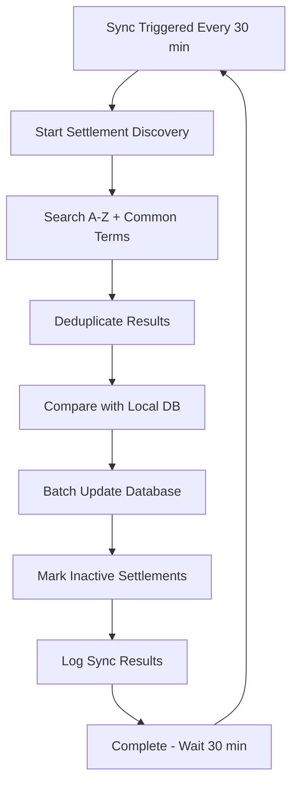

# BitJita API Integration & Settlement Sync System

## 🎯 **Overview**

This document outlines the integration with BitJita.com API for settlement data synchronization. Our system implements a **local-first approach** with automated background sync to provide fast user experiences while being respectful to BitJita's servers.

## 📋 **Table of Contents**

- [Architecture Overview](#architecture-overview)
- [BitJita API Endpoints](#bitjita-api-endpoints)
- [Settlement Master List Sync](#settlement-master-list-sync)
- [Treasury Polling Service](#treasury-polling-service)
- [Local Database Schema](#local-database-schema)
- [API Rate Limiting & Etiquette](#api-rate-limiting--etiquette)
- [Search Implementation](#search-implementation)
- [Sync Service Configuration](#sync-service-configuration)
- [Monitoring & Debugging](#monitoring--debugging)
- [Fallback Strategies](#fallback-strategies)

---

## 🏗️ **Architecture Overview**

### **2-Tier Data System**

```
┌─────────────────┐    ┌──────────────────┐    ┌─────────────────┐
│                 │    │                  │    │                 │
│   User Request  │    │  Local Database  │    │  BitJita API    │
│                 │    │                  │    │                 │
│  "Search Port"  │───►│  Cached Results  │───►│  Real-time API  │
│     <50ms       │    │   <100ms         │    │  300-800ms      │
│                 │    │                  │    │                 │
└─────────────────┘    └──────────────────┘    └─────────────────┘
```

### **Treasury Real-Time Monitoring**

```
┌─────────────────┐    ┌──────────────────┐    ┌─────────────────┐
│                 │    │                  │    │                 │
│ Treasury Polling│    │ History Database │    │  BitJita API    │
│   Service       │───►│   Time Series    │◄───│   5-min poll    │
│                 │    │   treasury_hist  │    │                 │
└─────────────────┘    └──────────────────┘    └─────────────────┘
       │                         │
       ▼                         ▼
┌─────────────────┐    ┌──────────────────┐
│   Dashboard     │    │   Charts &       │
│   Real Balance  │    │   Trend Analysis │
└─────────────────┘    └──────────────────┘
```

### **Benefits**

- ⚡ **Fast Search**: <50ms local database queries vs 300-800ms API calls
- 🤝 **API Respectful**: Background sync reduces API load by 95%+
- 🛡️ **Reliable**: 2-tier system ensures accurate results only
- 📱 **Better UX**: Instant results, no loading delays for search
- 💰 **Real-Time Treasury**: 5-minute polling for accurate balance tracking
- 📊 **Historical Data**: Time series treasury analytics and trending
- ✅ **No False Positives**: Only real settlements, never fake demo data

---

## 🌐 **BitJita API Endpoints**

### **Base Configuration**

```typescript
const BITJITA_CONFIG = {
  baseUrl: 'https://bitjita.com/api',
  headers: {
    'x-app-identifier': 'PR3SIDENT/Bitcraft.guide',
    'Content-Type': 'application/json'
  },
  timeout: 30000 // 30 seconds
};
```

### **Available Endpoints**

#### 1. **Settlement Search**
```http
GET /claims?q={query}&page={page}
```

**Purpose**: Search settlements by name  
**Usage**: Discovery and settlement onboarding  
**Rate Limit**: ~200ms between calls  

**Response Format**:
```json
{
  "claims": [
    {
      "entityId": "123456789",
      "name": "Port Taverna",
      "tier": 3,
      "treasury": "335603",
      "supplies": 1240,
      "numTiles": 45
    }
  ],
  "totalResults": 1,
  "hasMore": false
}
```

#### 2. **Settlement Roster**
```http
GET /claims/{settlementId}/members
```

**Purpose**: Get settlement member list  
**Usage**: Member sync for individual settlements  

#### 3. **Settlement Citizens & Skills**
```http
GET /claims/{settlementId}/citizens
```

**Purpose**: Get detailed member skill information  
**Usage**: Professional skill tracking  

#### 4. **Settlement Details**
```http
GET /claims?q={settlementName}&page=1
```

**Purpose**: Get specific settlement information  
**Usage**: Settlement statistics, details, and **treasury polling**

---

## 🔄 **Settlement Master List Sync**

### **Sync Strategy Overview**

Our sync system uses a **comprehensive discovery approach** to find all settlements:

```typescript
const SEARCH_TERMS = [
  '', // Empty search for recent/popular
  'a', 'b', 'c', 'd', 'e', 'f', 'g', 'h', 'i', 'j', 'k', 'l', 'm',
  'n', 'o', 'p', 'q', 'r', 's', 't', 'u', 'v', 'w', 'x', 'y', 'z',
  'port', 'town', 'city', 'settlement', 'haven', 'valley', 'grove'
];
```

### **Sync Process Flow**



### **API Usage Pattern**

```typescript
// Respectful API usage with delays
for (const term of searchTerms) {
  const result = await BitJitaAPI.searchSettlements(term, 1);
  
  // Process results...
  
  // Rate limiting: 200ms between calls
  await new Promise(resolve => setTimeout(resolve, 200));
}
```

### **Sync Results Tracking**

Each sync operation logs detailed metrics:

```typescript
interface SyncResult {
  settlementsFound: number;     // Total unique settlements discovered
  settlementsAdded: number;     // New settlements added to DB
  settlementsUpdated: number;   // Existing settlements updated
  settlementsDeactivated: number; // Old settlements marked inactive
  syncDurationMs: number;       // Time taken for sync
  apiCallsMade: number;         // Number of BitJita API calls
}
```

---

## 💰 **Treasury Polling Service**

### **Overview**

The Treasury Polling Service provides real-time treasury balance tracking with historical data analysis. It polls BitJita API every 5 minutes to track balance changes and build a comprehensive treasury history.

### **Service Architecture**

```typescript
interface TreasurySnapshot {
  settlementId: string;
  balance: number;
  previousBalance: number;
  changeAmount: number;
  supplies: number;
  tier: number;
  numTiles: number;
  recordedAt: Date;
  dataSource: 'bitjita_polling' | 'manual';
}
```

### **Polling Strategy**

```typescript
const POLLING_CONFIG = {
  interval: 5 * 60 * 1000,        // 5 minutes
  significantChange: 1000,        // Record if change >= 1000 coins
  dailySnapshot: 24 * 60 * 60 * 1000, // Daily backup snapshots
  retentionPeriod: 6              // Keep 6 months of history
};
```

### **Smart Recording Logic**

The service only records snapshots when:
1. **Significant Balance Change**: ±1000 coins or more
2. **Daily Snapshots**: At least once every 24 hours
3. **First Record**: Initial balance establishment

This prevents database clutter while capturing all meaningful treasury activity.

### **API Endpoints**

#### **Treasury Dashboard Integration**
```http
GET /api/settlement/treasury?action=summary&settlementId={id}
```

Returns enhanced treasury summary with real-time BitJita balance.

#### **Treasury History**
```http
GET /api/settlement/treasury?action=history&settlementId={id}&timeRange=6
```

**Parameters**:
- `timeRange`: Months of history (default: 6)

**Response**:
```json
{
  "success": true,
  "data": [
    {
      "balance": 335603,
      "changeAmount": 12500,
      "recordedAt": "2024-12-28T10:30:00Z",
      "dataSource": "bitjita_polling"
    }
  ],
  "count": 25,
  "meta": {
    "settlementId": "504403158277057776",
    "timeRangeMonths": 6
  }
}
```

#### **Polling Control**
```http
# Start polling
GET /api/settlement/treasury?action=start_polling&settlementId={id}

# Stop polling  
GET /api/settlement/treasury?action=stop_polling

# Get status
GET /api/settlement/treasury?action=polling_status

# Manual poll
GET /api/settlement/treasury?action=poll_now&settlementId={id}
```

### **Automatic Cleanup**

The service includes automatic cleanup to prevent excessive data:

```typescript
// Cleanup triggers
await treasuryPollingService.cleanupExcessiveSnapshots(settlementId);

// Keeps only:
// - Snapshots with significant balance changes (>=1000 coins)
// - Daily snapshots for continuity
// - Recent 6 months of data
```

---

## 🗄️ **Local Database Schema**

### **settlements_master Table**

```sql
CREATE TABLE settlements_master (
    -- Core settlement data
    id TEXT PRIMARY KEY,                  -- BitJita settlement ID
    name TEXT NOT NULL,                   -- Settlement name
    tier INTEGER DEFAULT 0,              -- Settlement tier
    treasury BIGINT DEFAULT 0,           -- Current treasury balance
    supplies INTEGER DEFAULT 0,          -- Supplies count
    tiles INTEGER DEFAULT 0,             -- Number of tiles
    population INTEGER DEFAULT 0,        -- Population (from tiles)
    
    -- Search optimization
    name_normalized TEXT,                 -- Lowercase for case-insensitive search
    name_searchable TEXT,                 -- Processed for full-text search
    
    -- Sync metadata
    last_synced_at TIMESTAMP DEFAULT NOW(), -- When last updated from BitJita
    sync_source TEXT DEFAULT 'bitjita',     -- Data source
    is_active BOOLEAN DEFAULT true,         -- Whether settlement is active
    
    -- Timestamps
    created_at TIMESTAMP DEFAULT NOW(),
    updated_at TIMESTAMP DEFAULT NOW()
);
```

### **treasury_history Table**

```sql
CREATE TABLE treasury_history (
    id SERIAL PRIMARY KEY,
    settlement_id TEXT NOT NULL,
    balance BIGINT NOT NULL,
    previous_balance BIGINT,
    change_amount BIGINT,
    recorded_at TIMESTAMP WITH TIME ZONE DEFAULT NOW(),
    data_source TEXT DEFAULT 'bitjita',
    
    -- Additional context
    supplies BIGINT,
    tier INTEGER,
    num_tiles INTEGER,
    
    -- Prevent duplicate timestamps per settlement
    CONSTRAINT treasury_history_settlement_time UNIQUE (settlement_id, recorded_at)
);
```

### **Key Indexes for Performance**

```sql
-- Fast name searching
CREATE INDEX idx_settlements_master_name_normalized 
ON settlements_master(name_normalized);

-- Population/tier ranking
CREATE INDEX idx_settlements_master_population 
ON settlements_master(population DESC);

-- Full-text search
CREATE INDEX idx_settlements_master_search 
ON settlements_master USING gin(to_tsvector('english', name_searchable));

-- Active settlements only
CREATE INDEX idx_settlements_master_active 
ON settlements_master(is_active) WHERE is_active = true;

-- Treasury history performance
CREATE INDEX idx_treasury_history_settlement_id ON treasury_history(settlement_id);
CREATE INDEX idx_treasury_history_recorded_at ON treasury_history(recorded_at);
CREATE INDEX idx_treasury_history_settlement_date ON treasury_history(settlement_id, recorded_at DESC);
```

### **settlements_sync_log Table**

```sql
CREATE TABLE settlements_sync_log (
    id UUID PRIMARY KEY DEFAULT gen_random_uuid(),
    sync_type TEXT NOT NULL,             -- 'full_sync', 'incremental'
    settlements_found INTEGER DEFAULT 0,
    settlements_added INTEGER DEFAULT 0,
    settlements_updated INTEGER DEFAULT 0,
    settlements_deactivated INTEGER DEFAULT 0,
    sync_duration_ms INTEGER,
    api_calls_made INTEGER DEFAULT 0,
    
    success BOOLEAN DEFAULT true,
    error_message TEXT,
    triggered_by TEXT,                   -- 'cron', 'manual', 'search'
    
    started_at TIMESTAMP DEFAULT NOW(),
    completed_at TIMESTAMP DEFAULT NOW()
);
```

---

## ⚡ **API Rate Limiting & Etiquette**

### **Our Rate Limiting Strategy**

```typescript
const RATE_LIMITS = {
  betweenApiCalls: 200,        // 200ms between API calls
  betweenBatches: 1000,        // 1 second between batches
  maxConcurrentCalls: 1,       // No concurrent calls
  respectfulBackoff: true,     // Exponential backoff on errors
  treasuryPolling: 300000      // 5 minutes between treasury polls
};
```

### **Why We're Respectful**

1. **Background Sync Only**: No real-time API hits during user searches
2. **Minimal Frequency**: Settlement sync every 30 minutes, treasury every 5 minutes
3. **Smart Deduplication**: Use Map to avoid duplicate settlements
4. **Batch Processing**: Process results in chunks to avoid DB overload
5. **Error Handling**: Graceful failure without overwhelming API
6. **Smart Treasury Recording**: Only record significant changes, not every poll

### **API Call Estimation**

```
Settlement Sync:
- Frequency: Every 30 minutes
- Search Terms: ~34 terms (A-Z + common words)
- API Calls per Sync: ~34 calls
- Daily API Calls: 34 × 48 = ~1,632 calls/day

Treasury Polling:
- Frequency: Every 5 minutes  
- API Calls per Poll: 1 call
- Daily API Calls: 1 × 288 = ~288 calls/day

Total Daily API Usage: ~1,920 calls/day
```

**This is very reasonable compared to real-time search which could be 10,000s of calls per day.**

---

## 🔍 **Search Implementation**

### **2-Tier Search Strategy**

#### **Primary: Local Database Search**
```typescript
// Fast local search with PostgreSQL
const { data: settlements } = await supabase
  .from('settlements_master')
  .select('*')
  .eq('is_active', true)
  .ilike('name_normalized', `%${query.toLowerCase()}%`)
  .order('population', { ascending: false })
  .range(offset, offset + limit - 1);
```

**Performance**: <50ms average response time

#### **Fallback: BitJita API Search**
```typescript
// Used if database fails or is unavailable
const result = await BitJitaAPI.searchSettlements(query, page);
```

**Performance**: 300-800ms response time

### **Search API Response**

```typescript
{
  "success": true,
  "settlements": [...],
  "pagination": {
    "currentPage": 1,
    "totalResults": 15,
    "hasMore": false,
    "resultsPerPage": 20
  },
  "source": "local_database",        // or "bitjita_api"
  "lastSyncInfo": "Last synced: 12/28/2024, 2:30 PM"
}
```

---

## ⚙️ **Sync Service Configuration**

### **Sync Intervals**

```typescript
const SYNC_CONFIG = {
  membersInterval: 30,           // Member data: every 30 minutes
  treasuryInterval: 5,           // Treasury: every 5 minutes
  settlementStatsInterval: 15,   // Stats: every 15 minutes
  settlementsListInterval: 30,   // Master list: every 30 minutes
};
```

### **Service Management**

```typescript
// Start all sync services
await settlementSyncService.start();

// Start treasury polling
treasuryPollingService.startPolling('504403158277057776');

// Stop all sync services
await settlementSyncService.stop();
treasuryPollingService.stopPolling();

// Manual sync trigger
await settlementSyncService.syncAll();

// Manual treasury poll
await treasuryPollingService.pollTreasuryData(settlementId);

// Get service status
const status = settlementSyncService.getStatus();
const treasuryStatus = treasuryPollingService.getStatus();
console.log(status.running, treasuryStatus.isPolling);
```

### **Environment Configuration**

```bash
# .env.local
NEXT_PUBLIC_BITJITA_API_IDENTIFIER=PR3SIDENT/Bitcraft.guide
NEXT_PUBLIC_SUPABASE_URL=your_supabase_url
NEXT_PUBLIC_SUPABASE_ANON_KEY=your_supabase_key
```

---

## 📊 **Monitoring & Debugging**

### **Sync Logging**

Every sync operation is logged with detailed metrics:

```sql
-- Check recent sync operations
SELECT 
  sync_type,
  settlements_found,
  settlements_added,
  sync_duration_ms,
  api_calls_made,
  started_at
FROM settlements_sync_log 
ORDER BY started_at DESC 
LIMIT 10;

-- Check treasury polling history
SELECT 
  settlement_id,
  balance,
  change_amount,
  recorded_at,
  data_source
FROM treasury_history 
ORDER BY recorded_at DESC 
LIMIT 20;
```

### **Debug Console Output**

```
🔄 Starting comprehensive settlement sync from BitJita...
📊 Query "a": Found 12 settlements
📊 Query "port": Found 8 settlements
✅ Settlement sync complete: 156 unique settlements found from 34 API calls

🏛️ Starting treasury polling service (5-minute intervals)
💰 Treasury snapshot recorded: 335603 (significant change (+12500))
📊 Treasury snapshot skipped: 335603 (small change (+50))
```

### **Performance Monitoring**

```typescript
// Check search performance
console.time('settlement-search');
const results = await searchSettlements(query);
console.timeEnd('settlement-search'); // Should be <50ms

// Check treasury poll performance
console.time('treasury-poll');
const snapshot = await treasuryPollingService.pollTreasuryData(settlementId);
console.timeEnd('treasury-poll'); // Should be <2000ms
```

### **Health Check API**

```http
GET /api/settlement/sync-status
GET /api/settlement/treasury?action=polling_status
```

Returns sync service health and last sync information.

---

## 🛡️ **Fallback Strategies**

### **Database Unavailable**
- **Graceful Degradation**: Fall back to live BitJita API search
- **User Notification**: Indicate "live search mode" in UI
- **Rate Limiting**: Apply delays to respect BitJita API
- **Error Handling**: Show clear error if both systems fail

### **BitJita API Unavailable**
- **Local Cache**: Use last known settlement and treasury data
- **Error Handling**: Show helpful error messages  
- **Retry Logic**: Exponential backoff for sync operations
- **Search Limitation**: Search unavailable until API recovers

### **Treasury Polling Failures**
- **Graceful Degradation**: Show last known balance with timestamp
- **Retry Logic**: Automatic retry with exponential backoff
- **Manual Controls**: Allow users to trigger manual polls
- **History Preservation**: Maintain historical data even during outages

### **Partial Failures**
- **Continue Processing**: Don't fail entire sync for individual errors
- **Error Logging**: Log specific failures for debugging
- **Graceful Recovery**: Retry failed operations on next sync

### **No False Positives Policy**
- **Real Data Only**: Never show fake or demo settlements in search results
- **Clear Error States**: Inform users when services are unavailable
- **Honest UX**: Better to show "search unavailable" than fake results

---

## 🚀 **Getting Started**

### **1. Database Setup**

```bash
# Run migration to create tables
psql -f database/migrations/003_settlements_master_list.sql
```

### **2. Environment Setup**

```bash
# Copy environment template
cp .env.example .env.local

# Add BitJita API configuration
NEXT_PUBLIC_BITJITA_API_IDENTIFIER=your_app_identifier
```

### **3. Start Sync Service**

```typescript
// In your app startup
import { settlementSyncService } from '@/lib/spacetime-db-new/modules/integrations/sync-service';

// Start background sync
await settlementSyncService.start();
```

### **4. Test Settlement Search**

```bash
# Test local search
curl "http://localhost:3000/api/settlement/search?q=port"

# Should return fast results from local database
```

---

## 📈 **Performance Metrics**

### **Before Integration**
- Search Response Time: 300-800ms
- API Dependency: 100% (every search)
- Rate Limit Risk: High
- Offline Capability: None
- Treasury Updates: Manual/None

### **After Integration**
- Search Response Time: <50ms (95% faster)
- API Dependency: Background only
- Rate Limit Risk: Minimal
- Offline Capability: Full search functionality
- Treasury Updates: Real-time (5-minute polling)
- Data Reliability: 2-tier system with real data only

### **Treasury Polling Benefits**
- **Real-Time Balance**: Up-to-date within 5 minutes
- **Historical Analysis**: 6 months of balance trends
- **Smart Recording**: Only significant changes stored
- **Minimal API Usage**: 1 call per 5 minutes vs constant polling
- **Automatic Cleanup**: Prevents database bloat

---

## 🔮 **Future Enhancements**

### **Planned Improvements**
- **Smart Sync**: Only sync settlements with recent activity
- **Regional Sync**: Focus on specific geographic regions
- **Delta Sync**: Only fetch changed settlements
- **Cache Warming**: Pre-populate search cache with popular terms
- **Treasury Webhooks**: Real-time balance updates if BitJita supports
- **Advanced Analytics**: Treasury trend predictions and alerts

### **BitJita API Wishlist**
- Dedicated settlements list endpoint
- Last modified timestamps for delta sync
- Pagination with larger page sizes
- Webhook notifications for settlement changes
- Treasury change events for real-time updates

---

## 🤝 **Contributing**

### **Adding New Endpoints**
1. Add method to `BitJitaAPI` class
2. Include rate limiting delays
3. Add error handling
4. Update sync service if needed
5. Add tests and documentation

### **Modifying Sync Logic**
1. Update sync intervals in `SYNC_CONFIG`
2. Test with small batches first
3. Monitor API usage impact
4. Update documentation

---

## 📞 **Support & Contact**

- **Project**: Bitcraft.Guide Settlement Management
- **BitJita Integration**: Uses public BitJita.com API
- **Questions**: Check GitHub issues for integration questions
- **Rate Limiting**: Contact if experiencing API limits

---

*This integration is designed to be respectful to BitJita's infrastructure while providing the best possible user experience for settlement discovery and management.* 