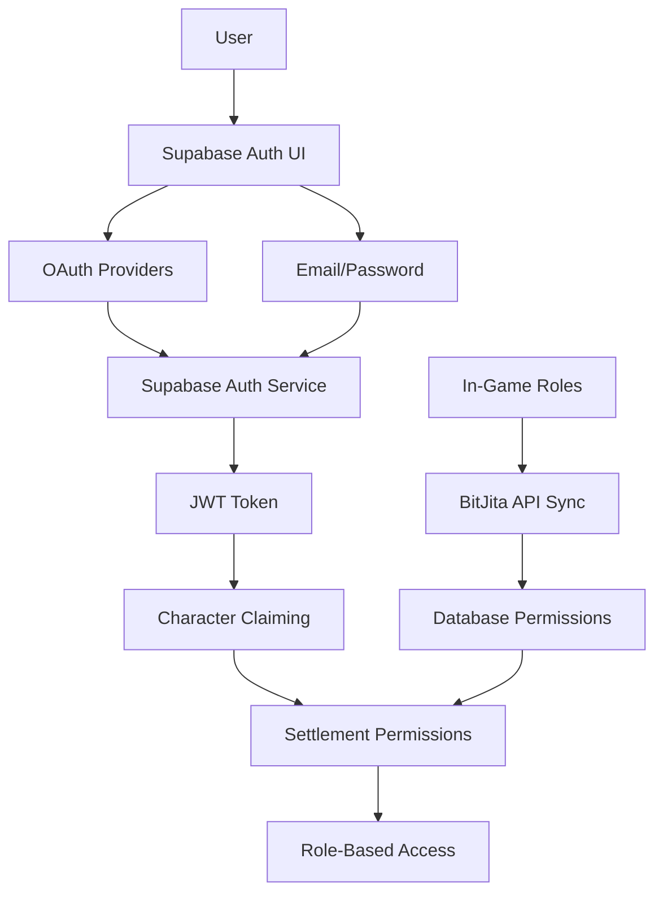

# 🔐 Authentication System Documentation

## Overview

The Bitcraft Settlement Management application uses **Supabase Auth** for user authentication, character claiming, and role-based access control. The system mirrors in-game settlement permissions to provide a seamless experience between the game and the web application.

## Architecture



## Authentication Flow

### 1. User Sign-In
- **OAuth Providers**: Google, Discord, GitHub
- **Email/Password**: Traditional authentication
- **Magic Links**: Passwordless authentication
- **Session Management**: Automatic token refresh

### 2. Character Claiming Process
1. User authenticates with Supabase
2. System checks for existing claimed character (`auth_user_id`)
3. If no character claimed, redirect to character selection
4. User selects their in-game character from settlement roster
5. System links Supabase `user.id` to `players.auth_user_id`
6. Character permissions sync from in-game data

### 3. Role-Based Access Control
Permissions mirror exact in-game settlement hierarchy:

| Role | Storage | Build | Officer | Co-Owner |
|------|---------|-------|---------|----------|
| **Member** | ❌ | ❌ | ❌ | ❌ |
| **Storage** | ✅ | ❌ | ❌ | ❌ |
| **Builder** | ❌ | ✅ | ❌ | ❌ |
| **Officer** | ❌ | ❌ | ✅ | ❌ |
| **Co-Owner** | ❌ | ❌ | ❌ | ✅ |

## Implementation Details

### Client-Side Authentication

#### useAuth Hook
```typescript
import { useAuth } from '@/hooks/use-auth'

function MyComponent() {
  const { user, session, loading, signOut } = useAuth()
  
  if (loading) return <div>Loading...</div>
  if (!session) return <div>Please sign in</div>
  
  return <div>Welcome {user.email}</div>
}
```

#### useSession Compatibility
```typescript
import { useSession } from '@/hooks/use-auth'

function MyComponent() {
  const { data: session, status } = useSession()
  // Drop-in replacement for NextAuth useSession
}
```

#### Permission Checking
```typescript
import { useSettlementPermissions } from '@/hooks/use-settlement-permissions'

function AdminPanel() {
  const { userRole, permissions } = useSettlementPermissions()
  
  if (!userRole?.canManageSettlement) {
    return <div>Access denied</div>
  }
  
  return <div>Admin controls...</div>
}
```

### Server-Side Authentication

#### API Routes
```typescript
import { getSupabaseSession } from '@/lib/supabase-server-auth'

export async function GET(request: Request) {
  const session = await getSupabaseSession(request)
  
  if (!session?.user) {
    return new Response('Unauthorized', { status: 401 })
  }
  
  // Access user data: session.user.id, session.user.email
  return Response.json({ data: 'protected' })
}
```

#### Server Components
```typescript
import { getSupabaseSession } from '@/lib/supabase-server-auth'
import { headers } from 'next/headers'

export default async function ProtectedPage() {
  const session = await getSupabaseSession(headers())
  
  if (!session?.user) {
    redirect('/auth/signin')
  }
  
  return <div>Protected content</div>
}
```

### Database Security

#### Row Level Security (RLS)
All settlement-related tables have RLS enabled:

```sql
-- Users can only access their own data
CREATE POLICY "Users can update their own data" ON players
  FOR UPDATE USING (auth_user_id = auth.uid()::text);

-- Users can view settlement data they belong to
CREATE POLICY "Users can view settlement data" ON projects
  FOR SELECT USING (
    EXISTS (
      SELECT 1 FROM players 
      WHERE auth_user_id = auth.uid()::text 
      AND settlement_id = projects.settlement_id
    )
  );
```

#### User-Settlement Linking
```sql
-- players table
CREATE TABLE players (
  id UUID PRIMARY KEY,
  auth_user_id TEXT UNIQUE, -- Supabase Auth user.id
  name TEXT NOT NULL,       -- In-game character name
  
  -- In-game permissions (synced from BitJita API)
  inventory_permission INTEGER DEFAULT 0,
  build_permission INTEGER DEFAULT 0,
  officer_permission INTEGER DEFAULT 0,
  co_owner_permission INTEGER DEFAULT 0,
  
  -- App metadata
  app_joined_at TIMESTAMP WITH TIME ZONE,
  app_last_active_at TIMESTAMP WITH TIME ZONE
);
```

## Environment Configuration

### Required Environment Variables
```env
# Supabase Configuration
NEXT_PUBLIC_SUPABASE_URL=https://your-project.supabase.co
NEXT_PUBLIC_SUPABASE_ANON_KEY=eyJ...
SUPABASE_SERVICE_ROLE_KEY=eyJ...

# OAuth Providers (configured in Supabase Dashboard)
# - Google: Client ID/Secret
# - Discord: Application ID/Secret  
# - GitHub: Client ID/Secret
```

### Supabase Dashboard Settings
1. **Authentication > Providers**: Enable OAuth providers
2. **Authentication > URL Configuration**: Set redirect URLs
3. **Authentication > Email Templates**: Customize email templates
4. **Database > RLS**: Policies automatically applied via migrations

## Security Features

### Session Security
- **JWT Tokens**: Secure, stateless authentication
- **Automatic Refresh**: Tokens refresh before expiration
- **HTTPS Only**: All auth endpoints require HTTPS
- **CSRF Protection**: Built-in cross-site request forgery protection

### Data Protection
- **Row Level Security**: Database-level access control
- **API Validation**: All endpoints validate user sessions
- **Permission Checking**: Role-based access throughout app
- **Audit Trail**: User activity tracking

### Character Security
- **One-Time Claiming**: Each character can only be claimed once
- **UUID Validation**: Strict format checking for user IDs
- **Settlement Isolation**: Users only access their settlement data

## Testing Authentication

### Local Development
1. Start development server: `npm run dev`
2. Visit: `http://localhost:3000/en/auth/signin`
3. Test OAuth providers or email/password
4. Verify character claiming flow
5. Test role-based navigation

### API Testing
```bash
# Test protected endpoint
curl -H "Authorization: Bearer YOUR_JWT_TOKEN" \
  http://localhost:3000/api/user/current-member

# Test settlement data access
curl -H "Authorization: Bearer YOUR_JWT_TOKEN" \
  http://localhost:3000/api/settlement/dashboard
```

## Troubleshooting

### Common Issues

#### "User not authenticated" errors
- Check if session exists: `console.log(session)`
- Verify JWT token is being sent to API
- Ensure user has claimed a character

#### Permission denied errors
- Verify user's in-game settlement role
- Check RLS policies in Supabase dashboard
- Confirm character claiming completed

#### OAuth callback errors
- Verify redirect URLs in Supabase dashboard
- Check OAuth provider configuration
- Ensure HTTPS in production

### Debug Tools
```typescript
// Client-side debugging
const { user, session } = useAuth()
console.log('User:', user)
console.log('Session:', session)

// Server-side debugging
const session = await getSupabaseSession(request)
console.log('Server session:', session)
```

## Migration Notes

### From NextAuth to Supabase Auth
- ✅ All `useSession` calls updated to Supabase
- ✅ Server session checking migrated
- ✅ Database schema updated for Supabase UUIDs
- ✅ RLS policies implemented
- ✅ Character claiming process rebuilt

### Breaking Changes
- `auth_user_id` now expects UUID format (Supabase)
- All existing user sessions invalidated (re-claim required)
- API routes now use `getSupabaseSession()` instead of `getServerSession()`

## Future Considerations

### Planned Enhancements
- **Multi-Settlement Support**: Users with characters in multiple settlements
- **Role Synchronization**: Real-time updates when in-game roles change
- **Advanced Permissions**: Fine-grained access control
- **Audit Logging**: Detailed user action tracking

### Maintenance
- **Token Rotation**: Monitor and rotate service role keys
- **Permission Sync**: Regular sync with BitJita API for role updates
- **Security Updates**: Keep Supabase client libraries updated
- **Monitoring**: Track authentication success/failure rates

---

## Quick Reference

### Key Files
- `src/hooks/use-auth.tsx` - Main auth hook
- `src/hooks/use-settlement-permissions.ts` - Role checking
- `src/lib/supabase-auth.ts` - Client-side utilities
- `src/lib/supabase-server-auth.ts` - Server-side utilities
- `src/app/auth/callback/route.ts` - OAuth callback handler

### Key Database Tables
- `players` - User-character mapping with permissions
- `auth.users` - Supabase managed user accounts (read-only)

### Key Environment Variables
- `NEXT_PUBLIC_SUPABASE_URL` - Public Supabase project URL
- `NEXT_PUBLIC_SUPABASE_ANON_KEY` - Public anonymous key
- `SUPABASE_SERVICE_ROLE_KEY` - Private service role key